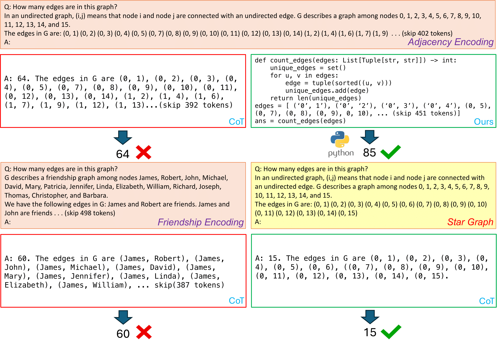

# CodeGraph: Enhancing Graph Reasoning of LLMs with Code

> [Qiaolong Cai](https://www.linkedin.com/in/qiaolong-cai-281018263/)*, [Zhaowei Wang](https://zhaowei-wang-nlp.github.io)\*, [Shizhe Diao](https://shizhediao.github.io), [James Kwok](https://www.cse.ust.hk/~jamesk/), [Yangqiu Song](https://www.cse.ust.hk/~yqsong/)

\* Equal contribution

## News
- **[2024/12/22]** Initial code released.
- **[2024/08/25]** Paper released on [arXiv](https://www.arxiv.org/abs/2408.13863).

## Introduction
This is the code repository for the paper: [CodeGraph: Enhancing Graph Reasoning of LLMs with Code](https://www.arxiv.org/abs/2408.13863).

We introduce CodeGraph, a method for reasoning about **basic graph problems** by encoding **graph problem solutions** as **code**. This method solves new graph problems by learning from exemplars, generating programs, and executing them via a program interpreter.



In the upper example, the limitation of LLMs in handling arithmetic within the graph task is highlighted, while our method addresses this issue through code and external execution. In the lower-left example, LLM performance is shown to be sensitive
to prompt templates that convert graph structures into natural language. The lower-right example demonstrates that the LLM’s
performance is significantly influenced by the graph structure.


## Getting Started

Follow the steps below to set up and start using **CodeGraph**:

### 1. Installation

Set up the required environment and APIs by following the instructions in the [Installation Guide](docs/installation.md).


### 2. Prepare the GraphQA Dataset

Generate graphs and prepare the dataset needed for evaluation by referring to the [Dataset Preparation Guide](docs/prepare_data.md).


### 3. Configure Prompts

Learn how to create prompts for **CodeGraph** and other prompt-based baseline methods by following the [Prompt Preparation Guide](docs/prepare_prompts.md). 

### 4. Run Evaluation

Reproduce the evaluation experiments presented in the paper. Detailed steps are available in the [Evaluation Guide](docs/evaluation.md).


## Related Projects

Our work is inspired by these excellent open-sourced repos: [PaL: Program-Aided Language Model](https://github.com/reasoning-machines/pal), [Program-of-Thoughts](https://github.com/TIGER-AI-Lab/Program-of-Thoughts).

Our code builds upon [Talk like a Graph](https://github.com/google-research/google-research/tree/bfa1a6eaaac2bbde8ab6a376de6974233b7456c1/graphqa). Many thanks to the them!


## Citation

If you find this project helpful, please consider citing the following paper:

```bibtex
@misc{cai2024codegraphenhancinggraphreasoning,
      title={CodeGraph: Enhancing Graph Reasoning of LLMs with Code}, 
      author={Qiaolong Cai and Zhaowei Wang and Shizhe Diao and James Kwok and Yangqiu Song},
      year={2024},
      eprint={2408.13863},
      archivePrefix={arXiv},
      primaryClass={cs.CL},
      url={https://arxiv.org/abs/2408.13863}, 
}
```


## License

This project is licensed under the Apache License 2.0. It incorporates code from [Talk like a Graph](https://github.com/google-research/google-research/tree/bfa1a6eaaac2bbde8ab6a376de6974233b7456c1/graphqa), also licensed under the Apache License 2.0.


## Contact

For questions or comments about the implementation, please contact:  [qcaiaj@connect.ust.hk](mailto:qcaiaj@connect.ust.hk)
